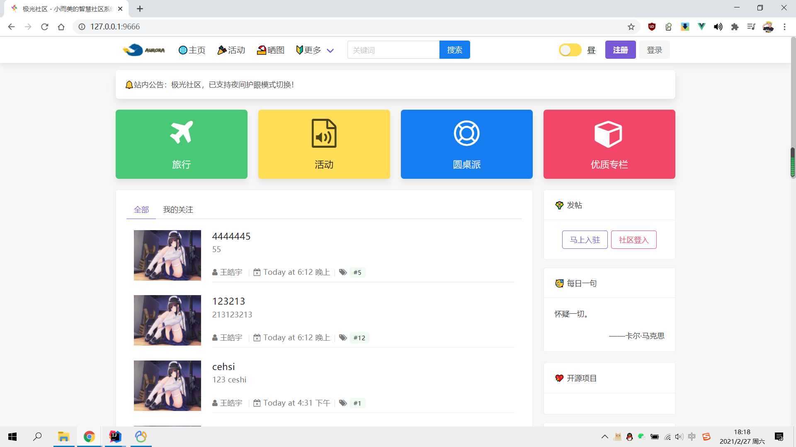
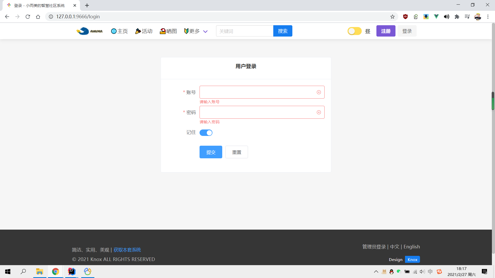
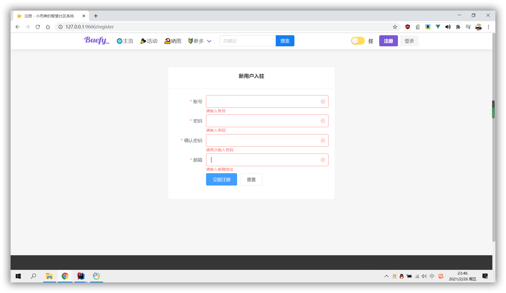
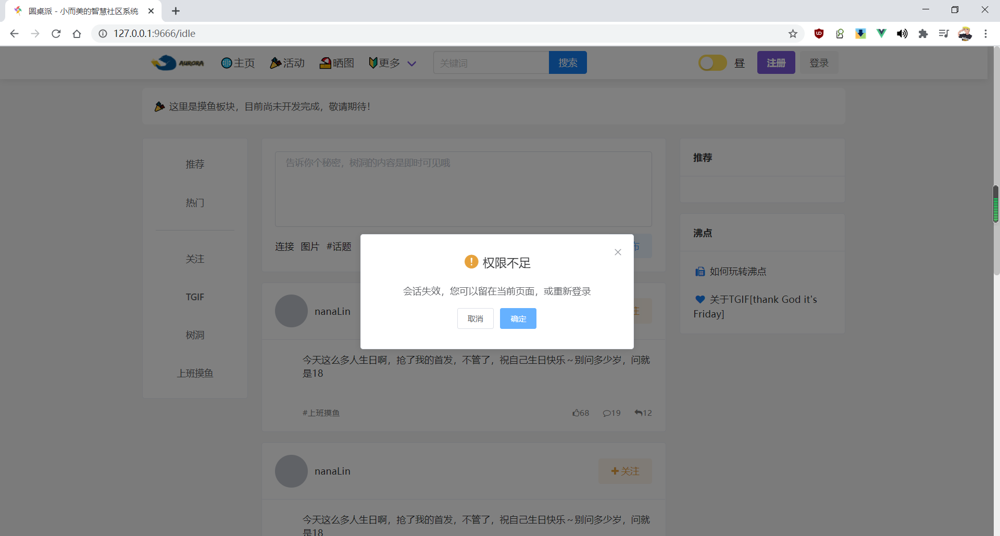
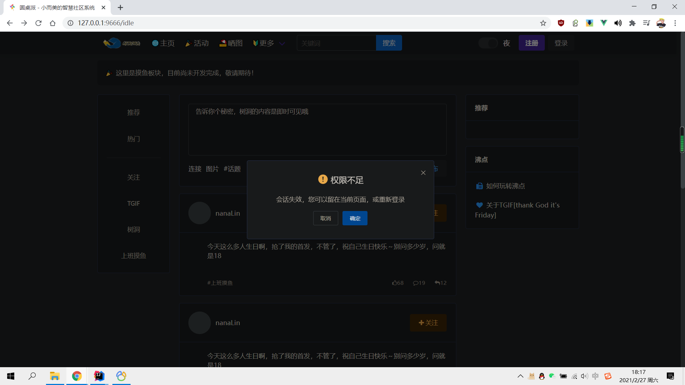

<div align="center">
<h2>极光社区</h2>
<p>一款基于Vue.js，Bulma，ElementUI的社区系统，支持 Markdown!</p>
<p>


</p>


<p><a href="./README.md">简体中文</a>&nbsp;&nbsp;-&nbsp;&nbsp;<a href="./README_EN.md">English</a></p>
</div>

> 有问题请提`issue`，想参与的朋友可以`fork`&`pr`；后台API请查看 [Aurora](https://github.com/haoyu21/aurora) 。

## 技术栈

- [x] Vue
- [x] Vue CLI
- [x] Vuex
- [x] Vue Router
- [x] Axios
- [x] Bulma
- [x] Buefy
- [x] Element
- [x] Vditor
- [x] Day.js
- [x] DarkReader


……

## 细节预览







## 安装指导

安装依赖

```
npm install

淘宝镜像
npm install --registry=https://registry.npm.taobao.org
```

启动项目

```
npm run serve
```

打包发布

```
npm run build
```

更多自定义配置
See [Configuration Reference](https://cli.vuejs.org/config/).

## 许可

Copyright 2020-present. Knox. Code released under [the Apache license](LICENSE).
